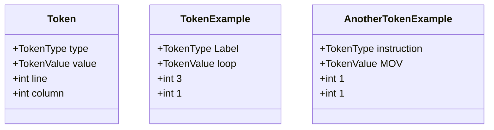
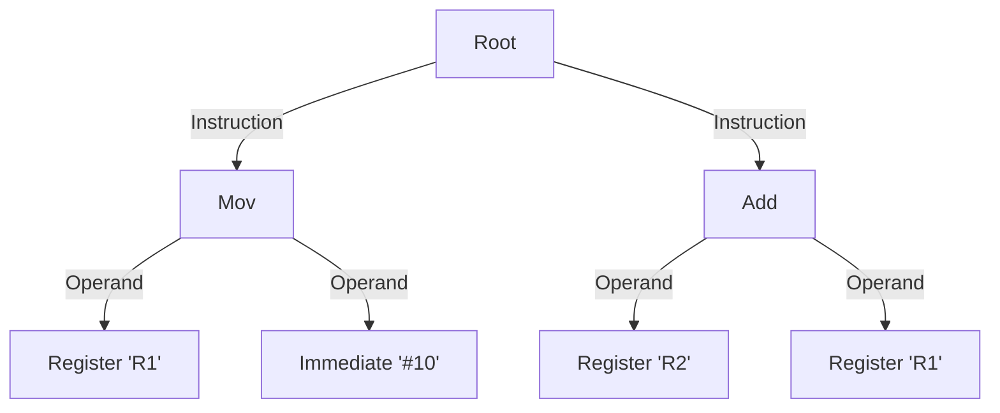
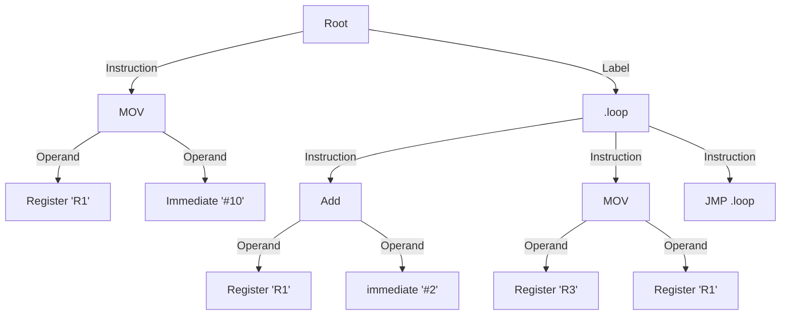
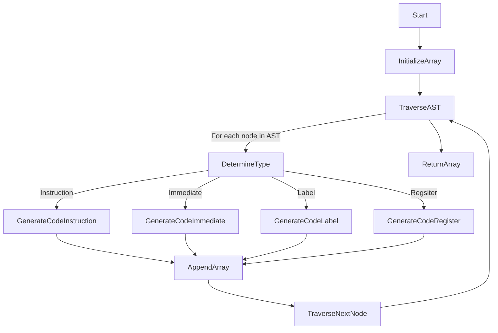
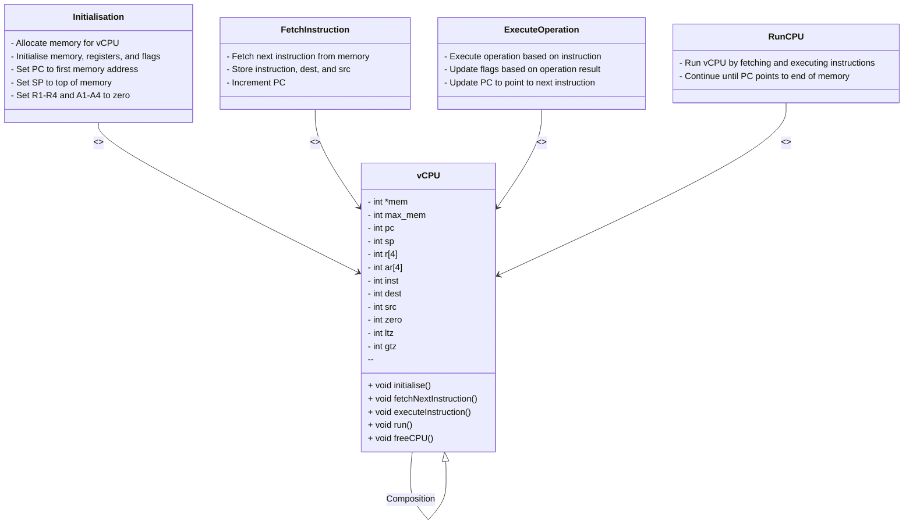

**Technical Specifications - 2023-2024-project-3-virtual-processor**

---

<details>
<summary>Table of Contents</summary>

- [I. Audience](#i-audience)
- [II. Overview](#ii-overview)
- [III. Glossary](#iii-glossary)
- [IV. Requirements](#iv-requirements)
- [V. Details](#v-details)
- [VI. Nice to have](#vi-nice-to-have)
- [VII. Priorities](#vii-priorities)
- [VIII. Technical Architecture](#viii-technical-architecture)
  - [1. Technology stack](#1-technology-stack)
  - [2. Input data](#2-input-data)
  - [3. Output data](#3-output-data)
  - [4. Non-requirements / Out of scope](#4-non-requirements--out-of-scope)
  - [5. Operating requirements](#5-operating-requirements)
  - [6. Key functions, operations, and algorithms](#6-key-functions-operations-and-algorithms)
  - [7. Algorithms](#7-algorithms)
    - [7.1. File Cleaning and Reading](#71-file-cleaning-and-reading)
    - [7.2. Lexical analysis (Tokenisation)](#72-lexical-analysis-tokenisation)
    - [7.3. Syntax analysis (Parsing)](#73-syntax-analysis-parsing)
    - [7.4. Semantic analysis](#74-semantic-analysis)
    - [7.5 Error handling system](#75-error-handling-system)
    - [7.6. Code generation](#76-code-generation)
      - [7.6.1. Instruction format](#761-instruction-format)
      - [7.6.2. Table of Opcodes](#762-table-of-opcodes)
      - [7.6.3. Code generation process](#763-code-generation-process)
    - [7.7. Virtual processor](#77-virtual-processor)
      - [7.7.1. vCPU structure](#771-vcpu-structure)
      - [7.7.2. Running the vCPU](#772-running-the-vcpu)
      - [7.7.3 Class diagram](#773-class-diagram)
- [IX. Syntax and Structure](#ix-syntax-and-structure)
  - [1. Folder structure](#1-folder-structure)
  - [2. Program file structure](#2-program-file-structure)
  - [3. Function declaration](#3-function-declaration)
  - [4. Naming](#4-naming)
  - [5. Comments](#5-comments)
- [X. Code Design Principles](#x-code-design-principles)
- [XI. Challenges](#xi-challenges)
- [XII. Possible Bugs](#xii-possible-bugs)
- [XIII. Development Process](#xiii-development-process)

</details>

## I. Audience

This document is primarily intended for:

- Software developer - to understand the user and technical requirements, and to guide decision-making and planning. Help them understand risks and challenges, customer requirements, and additional technical requirements and choices made  

Secondary audiences

- Program manager - to validate against the functional specification, and the client expectations
- QA - to aid in preparing the test plan and to use it for validating issues.
- Project manager - to help identify risks and dependencies

## II. Overview

 The goal of the project is to create a virtual processor and an interpreter for running a new assembly language invented by the team. 


## III. Glossary

| Term | Definition |
|------|------------|
|**breadth-first approach**| A breadth-first approach is a graph traversal method that starts at the root node and visits all the neighbouring nodes. Then for each of those nearest nodes, it visits their unexplored neighbour nodes, and so on, until it finds the goal.|
|**virtual processor**| A virtual processor is a software-based emulation of a physical processor. It is used to execute instructions and perform operations on data.|
|**opcode**| Short for "operation code," it is a code that represents a specific machine language instruction.|
|**little-endian**| A format for storing binary data in which the least significant byte comes first.|
|**LL Parsing Algorithm**| LL parsing is a top-down parsing method that processes input from left to right, aiming to construct a parse tree through leftmost derivations. It utilizes a predictive parsing table, often in LL(1) parsers, to make parsing decisions based on the leftmost non-terminal and a limited number of lookahead symbols.|
|**BNF**| A BNF specification is a set of derivation rules, written as:<br> ```<symbol> ::= __expression__``` <br>where: ```<symbol>``` is a nonterminal variable that is always enclosed between the pair <>.<br> ```::=``` means that the symbol on the left must be replaced with the expression on the right.<br> ```__expression__``` consists of one or more sequences of either terminal or nonterminal symbols where each sequence is separated by a vertical bar "|" indicating a choice, the whole being a possible substitution for the symbol on the left.|
|**Standard Libraries**| Standard libraries refer to pre-compiled, reusable code modules that provide a set of commonly used functions and procedures. These libraries aim to facilitate software development by offering a consistent and standardized set of tools and utilities.|
|**GCC (GNU Compiler Collection)**| GCC is a compiler system developed by the GNU Project. It includes compilers for various programming languages, such as C, C++, and Fortran. GCC is widely used in the open-source community and is a key tool for converting source code into executable programs.|
|**Top-Down**| Top-down is an approach or methodology where a problem is broken down into smaller, more manageable sub-problems. The solution is then built by addressing these sub-problems from the highest level down to the most detailed level.|
|**AST (Abstract Syntax Tree)**| An Abstract Syntax Tree is a hierarchical tree-like structure that represents the abstract syntactic structure of source code without the intricacies of specific syntax. ASTs are commonly used in compilers and interpreters to facilitate the analysis and transformation of code.|
|**Virtual Machine**| A virtual machine is a software-based emulation of a physical computer. It runs an operating system and applications, providing an isolated and consistent environment. Virtual machines are often used for testing, development, and running multiple operating systems on a single physical machine.|
|**CPU (Central Processing Unit)**| The CPU, or central processing unit, is the primary component of a computer responsible for executing instructions stored in a computer program. It performs arithmetic and logic operations and manages data flow within a system.|
|**Registers**| Registers are small, high-speed storage locations within a CPU that store data temporarily during program execution. They are used to hold operands and intermediate results for quick access by the CPU, enhancing processing speed.|


## IV. Requirements

1. Create a minimal assembly language (This requirement is fully described in the [functional specifications](./FunctionalSpecifications.md))

2. Develop a C program that reads assembly code from a file, checks for semantic correctness, and executes it on the virtual processor. In the case of an error, the program should display an error message in the virtual terminal

3. Implement a virtual system call for displaying text in a virtual terminal, that can be accessed from the assembly code  

4. Implement a virtual processor that can execute the assembly code

## V. Details

The project will be developed in plain, portable, C language without using any external library besides C standard libraries.

The project is divided into a virtual processor and an interpreter:

 1. Virtual processor components detailed:
      - 4 general-purpose registers
      - 4 address registers
      - 1 virtual terminal
      - 32-bit architecture


 2. The second part is the interpreter. The purpose of the interpreter is to read the assembly code from a file, check for semantic correctness, transform it into machine code and execute it on the virtual processor.
   
      Interpreter components detailed:
      - A lexical analyser
      - A parser
      - A semantic analyser
      - A code generator

## VI. Nice to have

- Have a built-in debugger
- I/O operations inside the virtual terminal
- Have a wiki page with a detailed description of the more complex algorithms used in the project

## VII. Priorities

1. Smooth performance, each assembly instruction should be executed in the same amount of time
2. Correctness, the program should be able to run any semantically correct assembly program
3. Flexibility, the system should be designed to handle various assembly constructs and provide a foundation for potential future extensions

## VIII. Technical Architecture

### 1. Technology stack

- Operating System: Any modern, widely used operating system with support for C development (e.g., Linux, Windows, macOS)
- Programming Language: C17 (the most recent standard version)
- Compiler: GCC 14.0.0
- Integrated Development Environment (IDE): Visual Studio Code
- No additional libraries can be used besides C standard libraries

### 2. Input data

One file on the command line.

- Arg[0] -  The input data will be an ASM2 file containing a program written in the assembly language. The file will be read by the interpreter and executed on the virtual processor.

### 3. Output data

The output data will be the result of the execution of the assembly program or the errors returned by the program. The result will be displayed in the virtual terminal.

### 4. Non-requirements / Out of scope

- Graphical debugger with visual representations of the register, data, and instruction memory

### 5. Operating requirements

- The program should be able to run on any modern operating system with support for C development (e.g., Linux, Windows, macOS)
- The program should be able to run on any modern computer with a 64-bit processor.

### 6. Key functions, operations, and algorithms

Some of the key operations that the software will perform and that need to be represented via functions are:

- **Lexical Analysis (Tokenisation):**
   - Breaking down assembly code into tokens (instructions, registers, operands)
   - Removing whitespace and comments
- **Syntax Analysis (Parsing):**
   - Analysing tokens and verifying adherence to the assembly language grammar
   - Constructing an abstract syntax tree (AST) representing code structure
- **Semantic Analysis:**
   - Checking for the correctness of the assembly code
   - Ensuring that instructions are used appropriately, and operands have the correct types
- **Code Generation:**
   - Translate AST into machine code
   - Mapping assembly instructions to corresponding C functions or operations
- **Virtual Processor Execution:**
   - Implementing a virtual processor with registers, memory, and an execution pipeline
   - Executing generated machine code

### 7. Algorithms  

The following section describes the algorithms described above in depth. Furthermore, it describes the skeleton of the program and the order in which the algorithms will be implemented.

#### 7.1. File Cleaning and Reading

Cleaning the file involves removing comments and whitespaces to facilitate easier reading. The size of the array storing the cleaned assembly code needs to be managed dynamically, considering potential memory constraints.

**Dynamic Array Allocation:**

   - The program will dynamically allocate memory for the array based on the size of the cleaned assembly code.
   - This dynamic allocation ensures flexibility, accommodating assembly programs of varying lengths without predefined size limitations.

```txt
// Initialise variables
// Initial assumption of a reasonable maximum number of lines

// Check for memory allocation success
    // Read the file line by line and dynamically allocate memory for each line
    // Assuming a maximum line length
        // Dynamically allocate memory for the current line

        // Check for memory allocation success
            // Handle memory allocation failure

    // Resize the array to the actual number of lines read

    // Continue with processing or error handling
    // Handle initial memory allocation failure


// Free allocated memory when done
```

Diagram of the cleaning function


**Note:**

- The initial assumption of the maximum number of lines provides a starting point for memory allocation.
- Dynamic resizing after reading the file ensures efficient memory utilisation based on the actual number of lines.
- The program will read the file line by line and will check either if it's a carriage return or 
  a line feed and remove it. Then, the program will remove the comments by checking if a ";" is 
  present in the line and if it is, it will remove everything after it. Finally, this new file 
  will be stored in a 2D array and will be used for the next step.

**Input data**

   ```asm2
   MOV R1, #1
   MOV R2, #2

   ; This is a comment
   ADD R3, R1
   ```

**Output data**

   ```terminal
   arrayFile[3][nbrLines]= {
      {"MOV", "R1", "#1"},
      {"MOV", "R2", "#2"},
      {"ADD", "R3", "R1"}
   }
   ```

**Errors handling**

The file cleaning and reading process will be able to handle errors linked to the content of the file and the file itself:

**Unexpected error:**
- **Error code:** 0x00	
- **Type of error:** Unexpected error
- **Message:** Oops... a problem in the matrix has been detected. Go to GitHub issues for help.

**File not found:**
- **Error code:** 0x01	
- **Type of error:** File not found
- **Message:** The file was not found. Check the name and/or directory in which the file is located.


**File secured with a password:**
- **Error code:** 0x02	
- **Type of error:** File secured with a password
- **Message:** Unable to access the file, which is password-protected

**Incorrect file extension:**
- **Error code:** 0x03	
- **Type of error:** Incorrect file extension
- **Message:** The file you are trying to open is not a recognised file.


**File corrupted:**
- **Error code:** 0x04	
- **Type of error:** File corrupted
- **Message:** The file you are trying to open appears to be corrupted.


**Empty file:**
- **Error code:** 0x05	
- **Type of error:** Empty file
- **Message:** The file you are trying to open contains no data.


#### 7.2. Lexical analysis (Tokenisation)

Tokenisation plays a crucial role by breaking down the assembly code into manageable units called tokens. Think of tokens as building blocks or Lego pieces that structure the code. Each token represents a specific element, like an instruction, register, or operand.

**Organisation:**
   - Tokens help organise the code into meaningful parts, making it easier for the computer to understand and process

**Simplification:**
   - Similar to spaces in a sentence, tokens simplify the code, aiding in the analysis of its structure

**Error Detection:**
   - Tokenisation aids in spotting errors early on. By breaking the code into tokens, we can quickly identify where issues might arise

**Efficient Parsing:**
   - Parsing the code becomes more efficient with tokens, acting as a clear guide for decoding the language

eg.

```terminal
// Non-Tokenised Assembly Code:
   {"MOV", "R1", "#1"},
   {"MOV", "R2", "#2"},
   {"ADD", "R3", "R1"}
```

```terminal
// Tokenised Assembly Code
   {Token("instruction", "MOV", 1, 1), Token("register", "R1", 1, 2), Token("immediate", "1", 1, 3)},
   {Token("instruction", "MOV", 2, 1), Token("register", "R2", 2, 2), Token("immediate", "2", 2, 3)},
   {Token("instruction", "ADD", 3, 1), Token("register", "R3", 3, 2), Token("register", "R1", 3, 3)}
```


**Note:**

The process for the tokenisation is the following:

   - The program will read the array line by line 
   - Then it will check every word of the line and it will create a token with the right type 
  and value according to the word. For this step, the "strcpm" function will be used to compare 
  the word with the list of instructions, registers and operands. It's easy to implement and 
  it's efficient.

  Here is an example of enum for the instruction. The same will be done for the registers and the operands.

  ```C
  typedef enum instruction
{
    ADD, 
    MOV,
    SUB, 
    MUL,
    DIV,
    JMP,
    JE,
    JNE,
    JG,
    JGE,
    JL,
    JLE,
    RET,
    CMP,
    CALL,
    AND,
    OR,
    XOR,
    NOT,
    GAD,
    DISP,
    END
} instruction_t;
```
   
   - Finally, it will replace each instruction, register and operand of the original array with the corresponding token

Each token will be represented by a struct with the following attributes:

   - **Type:** The type of the token (instruction, register, operand, etc...)
   - **Value:** The value of the token (MOV, R1, #1, etc...)
   - **Line:** The line where the token is located
   - **Column:** The column where the token is located



**Errors handling**

The tokenisation will be the first filter to check if the assembly code is correct. In this step the program will be able to handle the most obvious errors like:

**Incorrect instructions:**
- **Error code:** 0xA0	
- **Type of error:** Unknown instruction or operator	
- **Message:** Line number of the error + Code on the line + The operator or instruction does not exist.
  
**Incorrect registers:**
- **Error code:** 0xA1
- **Type of error:** Unknown register 
- **Message:** Line number of the error + Code on the line + The variable or register entered as a parameter does not exist
 
**Unexpected character**
- **Error code:** 0xB0
- **Type of error:** Unexpected character
- **Message:** Line number of the error + Code on the line + An unexpected character was spotted on the line.
   
  

#### 7.3. Syntax analysis (Parsing)

The parser acts like a language detective. It takes the tokens, which are like the words of our 
assembly code, and figures out the rules that govern their arrangement. Think of it as a grammar 
expert for computers.

1. **Understanding Structure:**
   - The parser helps the computer understand the structure of the assembly code. It's like teaching it the rules of the language so it can follow along.

2. **Error Checking:**
   - Just like a teacher correcting grammar mistakes, the parser checks if the code follows the correct assembly language rules.
3. **Creating a Plan:**
   - Once the parser understands the code structure, it creates a plan or a roadmap for the computer on how to execute the instructions. It's like giving directions for a task.

4. **Efficient Execution:**
   - By having a parser, the computer doesn't have to guess what the code means. It follows the parsed instructions step by step, ensuring efficient and accurate execution.

In a nutshell, the parser is like a language teacher and an instruction manual combined. It 
ensures the computer understands the code's structure, checks for mistakes, and creates a clear 
plan for smooth execution. In our project, having a reliable parser is key to making the virtual 
processor and interpreter work seamlessly.


**Note**

The process of the parsing is the following:

- Receive the tokenised assembly code obtained from the lexical analysis (tokenization) phase.

- Initialize a parsing pointer to the beginning of the token array.
  Set up data structures to represent the abstract syntax tree (AST)

  ```mermaid
  classDiagram
  class ASTNode {
    +TokenType type
    +TokenValue value
    +ASTNode* childrenRight
    +ASTNode* childrenLeft
    +int numChildren
  }

  class ASTBuilder {
    +initializeAST(): ASTNode
    +createASTNode(type: TokenType, value: TokenValue): ASTNode
    +addChild(parent: ASTNode, child: ASTNode): void
    +cleanupAST(root: ASTNode): void
  }

   ASTBuilder <|-- ASTNode
   ```

- Implement parsing rules based on those Backus–Naur Form (BNF) rules:

```bnf
<MOV> ::= <register> "," <register> | <register> "," <immediate> | <register> "," <adress>
<ADD> ::= <register> "," <register> | <register> "," <immediate> 
<SUB> ::= <register> "," <register> | <register> "," <immediate>
<MUL> ::= <register> "," <register> | <register> "," <immediate>
<DIV> ::= <register> "," <register> | <register> "," <immediate>
<AND> ::= <register> "," <register> | <register> "," <immediate>
<XOR> ::= <register> "," <register> | <register> "," <immediate>
<OR>  ::= <register> "," <register> | <register> "," <immediate>
<CMP> ::= <register> "," <register> | <register> "," <immediate>
<NOT> ::= <register> 
<GAD> ::= <register> 
<JMP> ::= <label>
<JE>  ::= <label>
<JNE> ::= <label>
<JG>  ::= <label>
<JGE> ::= <label>
<JL>  ::= <label>
<JLE> ::= <label>
<CALL>::= <label>
<RET> ::=
<END> ::=
<label> ::= "." <identifier>
<identifier> ::= <letter> | <identifier> <letter> | <identifier> <digit>
<letter> ::= "A" | "B" | "C" | "D" | "E" | "F" | "G" | "H" | "I" | "J" | "K" | "L" | "M" | "N" | "O" | "P" | "Q" | "R" | "S" | "T" | "U" | "V" | "W" | "X" | "Y" | "Z" | "a" | "b" | "c" | "d" | "e" | "f" | "g" | "h" | "i" | "j" | "k" | "l" | "m" | "n" | "o" | "p" | "q" | "r" | "s" | "t" | "u" | "v" | "w" | "x" | "y" | "z"
<digit> ::= "0" | "1" | "2" | "3" | "4" | "5" | "6" | "7" | "8" | "9"
```

These rules guide the parser in constructing the AST.

- Employ a top-down parsing approach, where the parsing process starts from the highest-level 
  constructs and gradually descends to lower-level details. This aligns with the hierarchical 
  nature of an assembly language.

- When an error is detected, the parser should provide error messages, including the position 
where is the line and the nature of the error. The error handling will be described in detail in 
the next section.

- As the parsing progresses successfully, construct the abstract syntax tree (AST) by linking 
  nodes according to the hierarchical structure of the assembly language. Each node in the AST 
  represents a syntactic construct, such as an instruction or operand.

- Once the entire token sequence is successfully parsed and the AST is constructed, the parsing 
  phase concludes. The AST becomes the basis for further processing.

---
eg.



---
eg.



---

**Errors handling**

The parser will be able to handle the following errors:

**Syntax error:**
- **Error code:** 0xC0
- **Type of error:** Syntax error
- **Message:** Line number of the error + Code on the line + Too many parameters have been added. Syntax should be : ARGUMENT PARAM1, PARAM2
  
**Missing return/end:**
- **Error code:** 0xC1
- **Type of error:** Missing return/end
- **Message:** An END or RET instruction is missing from the program.

**Unknown function or subroutine:**
- **Error code:** 0xA2
- **Type of error:** Unknown function or subroutine
- **Message:** Line number of the error + Code on the line + The function or subroutine you are trying to CALL does not exist.

---

#### 7.4. Semantic analysis

Semantic analysis is a vital stage in the compilation process. After the lexical and syntax 
analysis, the compiler moves on to the semantic analysis phase. This phase is responsible for 
checking the source code for semantic errors, which are errors in logic or meaning. For 
instance, it checks if the variables are declared before use if the function calls match the 
definitions, if the operators are applicable to the given operands, and so on.

**Meaningful Understanding:**
   - It ensures the computer grasps the intended meaning of the code, aligning everyone on the same page

**Correct Usage of Instructions:**
   - Like a wise friend correcting language misuse, semantic analysis checks for correct assembly instruction usage

**Operands Compatibility:**
   - Similar to preventing illogical comparisons, semantic analysis ensures compatible operands, avoiding confusion for the computer

**Preventing Confusion:**
   - By understanding the code's meaning, semantic analysis prevents confusion, ensuring correct execution


**Note:**

The process of the semantic analysis is the following:

- The program will receive the AST obtained from the parsing phase.
  
- The program will check if the operands have the correct types. For this step, the program will 
  compare the children of the same parent. For instance, if the instruction is ADD, the program will check if both operands are of the same type. If they are not, the 
  program will return an error message. 
  
- The program will also check if the labels are declared before use and if the function calls
 match the definitions. For this step, the program will use a hash table to store the labels and 
 the function calls. If a label is declared before use, the program will store it in the hash 
 table. If a function call is found, the program will check if the function is declared in the 
 hash table. If it's not, the program will return an error message.
  
- If an error is detected, the program will provide an error message, including the position 
  where is the line and the nature of the error. The error handling will be described in detail 
  in the next section.
  
- If no error is detected, the program will move to the next step, the code generation.


**Errors handling**

Errors recognized by the semantic analyser are as follows:

**Float number**
- **Error code:** 0xC3
- **Type of error:** Float number
- **Message:** Line number of the error + Code on the line + The language does not take floats into account.

**Mismatched Types:**
- **Error code:** 0xC4
- **Type of error:** Mismatched types
- **Message:** Line number of the error + Code on the line + The operands are not of the same type.


**Duplicate label:**
- **Error code:** 0xA3
- **Type of error:** Duplicate label
- **Message:** Line number of the error + Code on the line + The label you are trying to declare already exists.


#### 7.5 Error handling system


The interpreter incorporates an error handling system to ensure users receive clear and actionable errors regarding assembly code issues. It detects and reports errors at multiple stages of the interpretation process.

**Error Identification**

Syntax and semantic errors are systematically identified and stored in an error array during parsing and interpretation.

**Binary Transformation Check**

Before generating machine code from the assembly, the interpreter checks the error array. If empty, signifying no errors, the process proceeds. If errors are present, the interpreter stops and initiates error handling.

**Error Reporting**

Detected errors are reported to the user through the virtual terminal. Details include the error nature and source code location.
To open the virtual terminal we are going to use the system function from the C standard library.
Here is an example of how to open a new terminal window with a message using the system function for Macos:

```c
#include <stdlib.h>
#include <stdio.h>

void openVirtualTerminal(char* message) {
    char command[100];
    
    // Use osascript to open a new Terminal window with the specified message
    sprintf(command, "osascript -e 'tell application \"Terminal\" to do script \"%s\"'", message);
    system(command);
}

int main() {
    // Example usage
    openVirtualTerminal("Example of error message");

    return 0;
}
```


#### 7.6. Code generation

Once the assembly code is successfully parsed and analysed semantically, the interpreter proceeds to the code generation phase. This phase involves translating the abstract syntax tree (AST) into machine code, which the virtual processor can execute.


**Mapping Assembly Instructions to Machine Code:**
   - Each assembly instruction is mapped to a corresponding machine code instruction. 
   - The machine code is stored in an array, ready for execution.
   

  **Assembly Code Size:** Each data in the assembly code is in 32-bit format.

  **Instruction Width:** Every instruction is 48 bits wide.

  **Data Storage:** Data is stored in little-endian format.

##### 7.6.1. Instruction format

- **Opcode (Byte 1):** The first byte signifies the opcode of the instruction.
- **Register (Byte 2):** The second byte represents the register.
- **Data Bytes (Bytes 3-6):** The third, fourth, fifth, and sixth bytes collectively encode the data associated with the instruction.

Here is the complete table of the instructions and the corresponding binary code:

##### 7.6.2. Table of Opcodes

|**Instruction**| **Opcode** |
|-----------|----------------|
|MOV R1, 0X332| 0x10         |
|MOV A1, adress|0x11         |
|MOV R1, R2|    0x12         |
|-|       -                  |
|ADD R1, R2|    0x20         |
|ADD R1, 0X332 |0x22         |
|SUB R1, R2|    0x21         |
|SUB R1, 0X332 |0x23         |
|MUL R1, R2|    0x30         |
|MUL R1, 0X332| 0x31         |
|DIV R1, R2    |0x40         |
|DIV R1, 0X332|0x41          |
|-|          -               |
|.label|       0x99  + name  |
|END|          0x98          |
|RET|          0x97          |
|CALL|         0x96  + name  |
|-|            -             |
|CMP R1, R2|   0x50          |
|CMP R1, 0X332|0x51          |
|-|       -                  |
|JMP .label|   0x60  + name  |
|JE .label|    0x61  + name  |
|JNE .label|   0x62  + name  |
|JG .label|    0x63  + name  |
|JGE .label|   0x64  + name  |
|JL .label|    0x65  + name  |
|JLE .label|   0x66  + name  |
|-|-                         |
|AND R1, R2|   0x70          |
|AND R1, 0X332|0x71          |
|XOR R1, R2|   0x72          |
|XOR R1, 0X332|0x73          |
|OR R1, R2|    0x74          |
|OR R1, 0X332| 0x75          |
|NOT R1|       0x76          |
|GAD R1|       0x77          |
|-|       -                  |
|**General Register**|       |
|R1 |          0x01          |
|R2 |          0x02          |
|R3 |          0x03          |
|R4 |          0x04          |
|**Adress register** |       |
|A1 |          0x11          |
|A2 |          0x12          |
|A3 |          0x13          |
|A4 |          0x14          |


Splitting the same instruction into different binary codes allows the virtual processor to know exactly what to do with the instruction. If we take the example of the MOV instruction, it's going to be split into three different binary codes. 

The first one is going to be used when we want to move a value to a register, the second one is going to be used when we want to move a value to an address and the third one is going to be used when we want to move a value from a register to another register.

**Example of MOV instruction**

|0x12| 0x01| 0x00| 0x00| 0x00| 0x02|
|----|-----|-----|-----|-----|-----|
|MOV | R1  | R2| | | |
|OPCODE| REGISTER | DATA | DATA | DATA | DATA |

|0x10| 0x01| 0x00| 0x00| 0xE7| 0x09|
|----|-----|-----|-----|-----|-----|
|MOV | R1  | 2535 | |  |  |
|OPCODE| REGISTER | DATA | DATA | DATA | DATA |


Each label is going to be stored in a label table with its corresponding address. The label table is going to be used to store the corresponding binary code for each label.

To simplify the process. We are going to create 2 tables. The first one is going to store the label and the second one is going to store the corresponding binary code for each label. Each label and address will have the same index in their respective table.


**Example of label**

|0x99| 0x00| 0x00| 0x00| 0xBA| 0x01|
|----|-----|-----|-----|-----|-----|
|.| l | o | o | p |  |
|LABEL| UNUSED | NAME | NAME | NAME | NAME |

In this example, |0xBA| 0x01| represents the sum of each ASCII code for each letter of the label. 
So in this example, loop is equal to 108+111+111+112 = 442 = 0x01BA


The label .loop is going to be stored in the label table with the corresponding binary code. The fact that the label is stored in the label table is going to allow the virtual processor to know exactly where to jump when it encounters a jump instruction. 

##### 7.6.3. Code generation process

---



---

**Note:**

The process of the code generation is the following:

- The program will receive the AST obtained from the semantic analysis phase.
- The program will traverse the AST and for each node, it will determine the type of the node. 
  - If the node is an instruction, the program will generate the corresponding binary code. 
  - If the node is an immediate, the program will generate the corresponding binary code. 
  - If the node is a label, the program will transform the name of the label into ASCII code then it will sum all the ASCII code from letters and generate the binary code of this number.
  - If the node is a register, the program will generate the corresponding binary code.
- The program will append the binary code to an array.
- The program will continue to traverse the AST until the end of the AST.
- The program will return the array of the binary code.

**Input data**


**Output data**

```terminal
arrayBinaryCode[6]= {
    0x120x010x000x000x000x02,
    0x100x010x000x000x000x0A,
    0x90x000x000x000x6C0x6F,
    0x200x010x000x000x000x02,
    0x200x030x000x000x000x01,
    0x600x000x000x000x6C0x6F}
```
It's only a visual representation of the data don't take it as a real code.


#### 7.7. Virtual processor

This phase involves the implementation of the virtual processor, which is going to execute the machine code previously generated.


##### 7.7.1. vCPU structure

  ```mermaid
  classDiagram
   class vCPU{
   int *mem;
	int max_mem;

	// registers
	int pc;
	int sp;
	int r[4];
	int ar[4];

	// instruction parts
	int inst;
	int dest;
	int  src;

	// flags
	int zero;
	int ltz;
	int gtz;
   }
```

This structure represents the state of the CPU and contains various fields:

- mem: A pointer to the array containing the binary code representing the memory of the CPU.
- max_mem: The maximum size of the memory.
- pc: Program counter, holds the memory address of the current instruction being executed.
- sp: Stack pointer, holds the memory address of the top of the stack.
- r: An array representing the general-purpose registers.
- ar: An array representing the floating-point registers.
- inst, dest, and src: Variables to hold parts of the current instruction being executed.
- zero, ltz, and gtz: Flags to indicate whether the result of the previous operation was zero, negative, or positive, respectively.

##### 7.7.2. Running the vCPU

The vCPU will execute the machine code by following these steps:

**Initialisation:**
   - Allocate memory for the vCPU
   - Initialise the memory, registers, and flags to their default values
   - The program counter (PC) will be set to the first memory address
   - The stack pointer (SP) will be set to the top of the memory
   - The general-purpose registers (R1-R4) and the address registers (A1-A4) will be set to zero

**Fetching the next instruction:**
   - The vCPU will fetch the next instruction from memory using the program counter (PC)
   - The instruction will be stored in the inst variable
   - The destination and source operands will be stored in the dest and src variables, respectively ( in the case of a label or a function call, the name of the label or the function will be stored in the dest variable)
   - The program counter (PC) will be incremented to point to the next instruction
   - The vCPU will decode the instruction and determine the operation to execute

**Execute the operation:**
   - The vCPU will execute the operation based on the binary code of the instruction ( the use of a switch statement will be used to handle each instruction type) 
   - The vCPU will update the flags based on the result of the arithmetic operation
   - The vCPU will update the program counter (PC) to point to the next instruction

**Run the vCPU:**
   - The vCPU will run the machine code by fetching and executing instructions
   - The vCPU will continue to execute instructions until the program counter (PC) points to the end of the memory

##### 7.7.3 Class diagram

Here is the class diagram of the vCPU:



**Error handling**

**Division by 0**
- **Error code:** 0xC2
- **Type of error:** Division by 0
- **Message:** Line number of the error + Code on the line + It is impossible to divide by 0.

**Overflow error**
- **Error code:** 0xD0
- **Type of error:** Overflow error
- **Message:** Overflow error	The program was halted due to an overflow.

**Floating number error**
- **Error code:** 0xC3
- **Type of error:** Floating number error
- **Message:** Line number of the error + Code on the line + The language does not take floats into account.


## IX. Syntax and Structure

### 1. Folder structure

```txt
📦2023-2024-project-3-virtual-processor
└── 📁.github
|    └── 📁ISSUE_TEMPLATE
|    |   └── 📄 bug_report.yml
└── 📁Documents
|    └── 📁Appendices
|    └── 📝 ProjectCharter.md
|    └── 📝 TechnicalSpecifications.md
|    └── 📝 FunctionalSpecifications.md
|    └── 📝 TestPlan.md
|    └── 📁QaArtefacts 
|    └── 📁ManagementArtefacts 
└── 📁Src
|    └── 📄 vm.h
|    └── 📄 lexical.h
|    └── 📄 parser.h
|    └── 📄 global.h
|    └── 📄 assemblyCode.asm2
|    └── 📄 interpreter.c
└── 📄 .gitignore
└── 📄 LICENSE
└── 📝 README.MD 
```

**vm.h** - Header file for the virtual processor

**lexical.h** - Header file for the lexical analysis

**parser.h** - Header file for the parser and semantic analysis

**global.h** - Header file for the global variables and centralised point for all the header files import

**assemblyCode.asm2** - Assembly code file

**interpreter.c** - Main file for the entire interpreter

### 2. Program file structure

1. **Prologue:**
   - Start the file with a prologue describing the purpose of objects (functions, data declarations, etc.)
   - *Optionally include author(s), revision control information, references, etc*

2. **Header Files:**
   - Include any necessary header files, such as `#include <stdio.h>`
   - The "system includes" must precede "user includes" for clarity
   - Comment on non-obvious inclusions, if any

3. **Defines and Typedefs:**
   - Define constants first, followed by function macros, typedefs, and enums

4. **Global Data Declarations:**
   - Order global data declarations as follows:
      - Externs
      - Non-static globals
      - Static globals

5. **Functions:**
   - Arrange functions in a meaningful order, considering a "breadth-first" approach
   - Group similar functions together for clarity
   - Consider alphabetical order for large sets of independent utility functions

### 3. Function declaration

Each function should be preceded by a block comment prologue that gives a short description of what the function does.

### 4. Naming

- **File names**: should be in camelCase
- **`#define`:** constants should be in all CAPS
- **Enum constants**: are in all CAPS
- **Function**, **typedef**, and **variable names**, as well as **struct**, **union**, and **enum tag names**, should be in camelCase
- **Macro "functions"** are in all CAPS
- **Typedef** names should have "`_t`" appended to their name

### 5. Comments

- Putting comments at the top of a 3-10 line section telling what it does

```txt
/*
* Here is a block comment.
* The comment text should be tabbed or spaced over uniformly.
* The opening slash-star and closing star-slash are alone on a line.
*/ 
```

## X. Code Design Principles

The following are the coding design principles:

 - No use of third-party libraries
 - Emphasise improved algorithmic complexity over micro-optimisation
 - Use unit tests to ensure correctness during development


## XI. Challenges

- Developing a robust lexer and parser for precise assembly code tokenisation, and managing 
  diverse language constructs, poses a significant challenge
- Enforcing correct usage of assembly instructions and operands through semantic analysis 
  requires careful consideration to detect and prevent potential runtime errors
- Implementing parsing by string comparison is relatively straightforward; the true challenge 
  lies in the conversion to machine code
- Handling labels and function calls within the assembly code introduces an additional 
  challenge, requiring effective management of addresses, offsets, and the intricacies of 
  control flow

## XII. Possible Bugs

- The system may not be able to handle large assembly programs
- The system may not be able to handle complex assembly programs
- The system takes too long to execute
- The system may have trouble translating the assembly code into machine code and it can result 
  in an incorrect result
- The system may not be able to detect major errors for instance: overflow, underflow, division 
  by zero, etc
- We assume that the user will not comment until the end of the line, if it does, the system may 
  not be able to detect it

## XIII. Development Process

- Begin development with a minimal tokenization parser and a basic virtual processor
  
- Limit the virtual processor to handle only 2 or 3 instructions initially
  
- Focus on understanding key concepts like tokenization, parsing, and basic execution
  
- Gradually expand the implementation to include more instructions as comprehension grows
  
- Improve parsing rules and enhance the virtual processor's capabilities step by step
  
- Adopt an incremental approach to systematically handle the project's full-size development

